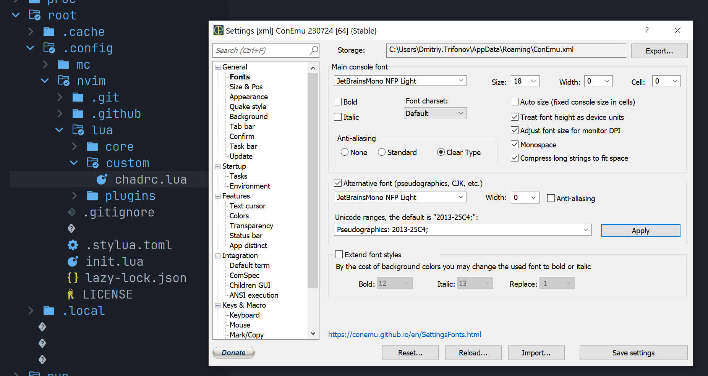

# rust-dev-environment-docker
Docker file with rust developemnt environment preinstalled (alpine, rust, neovim)

# install terminal

Download ["JetBrainsMono Nerd Font"](https://github.com/ryanoasis/nerd-fonts/releases/download/v3.1.1/JetBrainsMono.zip) and install it.

I am using MS PowerShell 7, which run in ConEmu.
Best presentation (icons shown without cutoff) is with "JetBrainsMono NFP" font family. I prefer "Light" variant.
See result below:

# run container in docker

    docker build -t "extde/rust-dev-environment" .
    docker create -t --name rust-alpine extde/rust-dev-environment
    docker start rust-alpine
    docker exec -it rust-alpine ash

Then start nvim to finish configuration

    nvim
